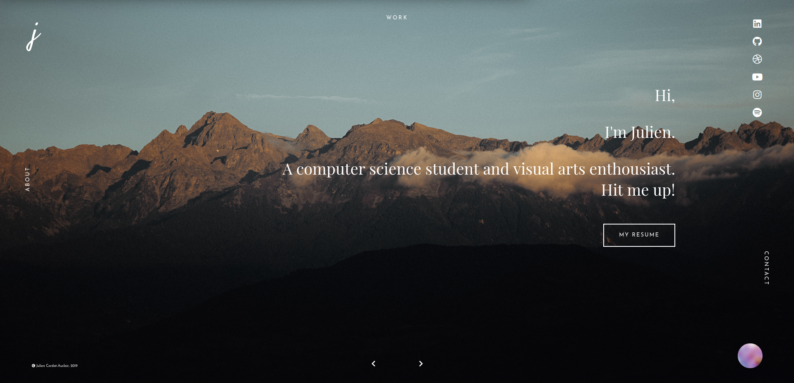

<h1 align="center">
   
  <b>Personal website (2019)</b>
   
</h1>

<h4 align="center">A presentation of my 2019 personal website</h4>

  
  
  

  <a href="#overview">Overview</a> •
  <a href="#screenshots">Screenshots</a> •
  <a href="#license">License</a>

  

## **Overview**

For this new version of my website, I focused on JavaScript syntax in order to create some visually appealing effects.

I used **HTML & CSS**, **JavaScript**, **Bootstrap** and **PHP** to allow users to send me emails directly from an appropriate web page.

## **Screenshots**

**Homepage**:

- *desktop*:

  

- *mobile*:

  

**About**:

  

**Mobile menu**:

  

## **License**

© **[Julien Cordat-Auclair](https://github.com/jcordatauclair)**
